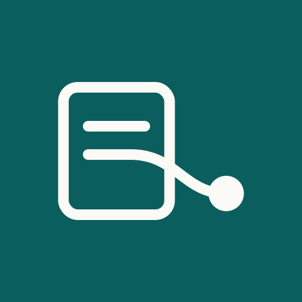

# PM Interview Coach



PM Interview Coach is a plugin for project, program and product managers (and close roles such as technical program manager, scrum master, PMO lead and business analyst) who are preparing for a job interview. You paste your resume and, if you have one, the job posting. The plugin finds the resume lines a hiring manager is likely to press on, turns each into a question that quotes your own line, maps the posting requirements to your resume, and adds behavioral questions for the role. You then practise one question at a time: you answer in your own words, the plugin checks the structure of the answer, and Claude gives feedback built only from facts you supplied. The session ends with a short scorecard.

The skill instructs Claude never to invent a figure, employer, date or outcome for you, and never to promise any result of an interview. Missing facts are asked for, not filled in.

## What is in this plugin

- `skills/pm-interview-coach/SKILL.md`: the coaching skill. It tells Claude how to run the practice session (one question at a time, no invented facts, feedback order, scorecard).
- `.mcp.json`: one remote MCP server, PM Career Desk, at `https://app.pmcareerdesk.com/mcp`. No sign-in. All tools are read-only.
- `assets/`: the PM Career Desk icon (SVG and PNG).

The skill uses two tools of the PM Career Desk server:

- `prepare_interview_questions`: reads the resume text and the optional job posting with fixed rules and returns the questions, the points a strong answer includes and the requirement map.
- `check_interview_answer`: checks the structure of one practice answer (situation, your own action, result, a before and after figure or a named record, length, filler words, the balance of "we" and "I").

The same server also offers a resume line check and the PM Archetype test. The plugin runs nothing on your computer: no scripts, no hooks, no package installs.

## Install

In Claude (web, desktop, Cowork), once the plugin is listed in the directory: open Customize, then Plugins, find PM Interview Coach and add it. Then connect the PM Career Desk connector from the plugin's Connectors tab (no account is needed).

Before the listing is live, you can add only the connector: Customize, then Connectors, then Add custom connector, with the URL `https://app.pmcareerdesk.com/mcp`.

In Claude Code:

```
claude plugin marketplace add DmitriiSelkov/pm-interview-coach
claude plugin install pm-interview-coach@pm-career-desk
```

Then ask, for example: "Help me prepare for a program manager interview. Here is my resume and the job posting."

## What is sent, and privacy

When the skill calls a tool, Claude sends the text the tool needs (the resume text, the job posting, or one practice answer) to `https://app.pmcareerdesk.com/mcp`. Nothing else is sent: not your other conversations, not your files, not Claude's memory. Contact details are removed before the rules read the text.

We do not store the text you send through the connector. We count which tool was used.

Your conversation with Claude is governed by Anthropic's terms and privacy policy. Our Privacy Notice: https://pmcareerdesk.com/privacy/. Terms: https://pmcareerdesk.com/terms/.

## AI disclosure

Reed (AI) is the PM Career Desk analyst named in the tool results. Reed is software, not a person. The questions and structure checks come from fixed rules written by the PM Career Desk team; no person reads what you send. The conversation and the feedback are written by Claude, an AI model, in your own Claude session. You decide what to say in an interview.

## Limits

- English resumes and postings. Resume up to 30,000 characters, posting up to 15,000, one answer up to 6,000.
- The question bank is a first version. For some large US employers it adds questions built from the principles and hiring pages the company publishes, with links to those pages. They are our questions, not the company's.
- The structure check does not judge whether a story is true.

## Support

Email support@pmcareerdesk.com. Documentation: https://pmcareerdesk.com/interview-coach/.

PM Career Desk is a service of PME Consulting, Inc. This plugin is not made or endorsed by Anthropic.

## License

See the LICENSE file.
